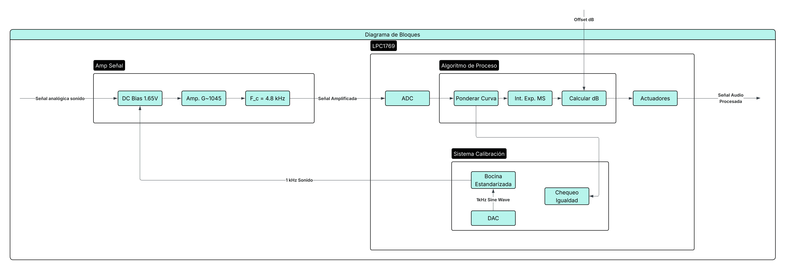
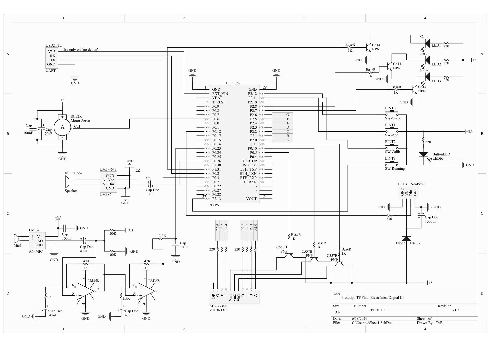
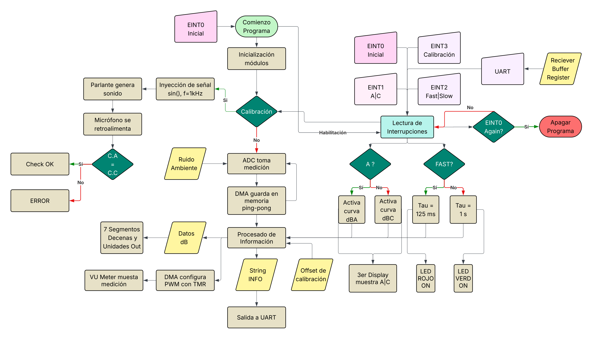
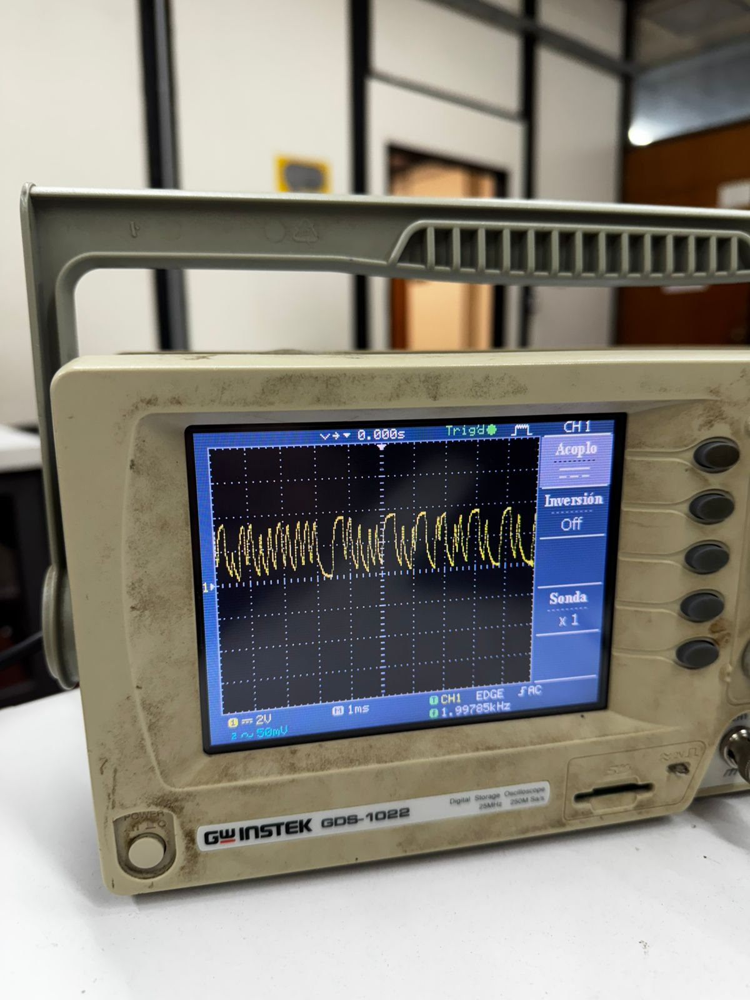
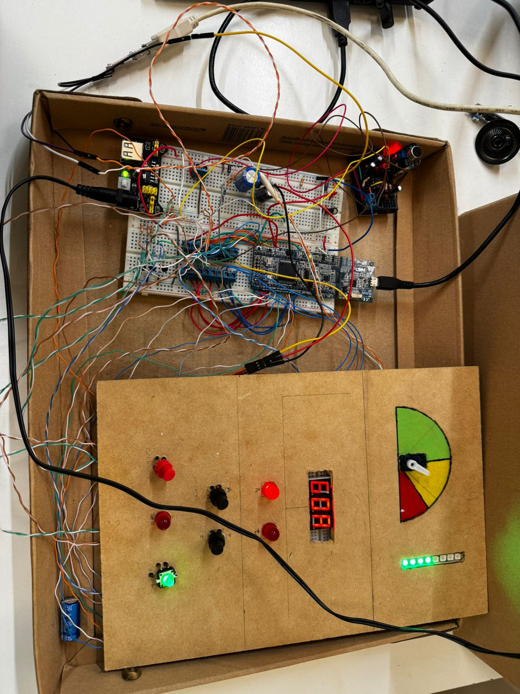

# Sistema de Medición de Nivel Sonoro - Sonómetro
> **Asignatura:** Electrónica Digital III - Universidad Nacional de Córdoba

> **Integrantes:**
> * Thomas von Büren - 43136697
> * Giovanna Luz Barbero - 46509956

> **Profesor:** Ing Marcos Blasco

---

## 🚀 1. Descripción General del Proyecto
Se toman mediciones del sonido ambiente mediante un micrófono, se procesa la información mediante estándares industriales aplicados a decibelímetros sonoros regulados, y se devuelve un valor en decibelios para ser expuesto mediante actuadores, indicadores visuales, e interfaces de comunicación. Posee un modo de auto-calibración.

### 🎯 Alcances del Proyecto 
* **El sistema SÍ es capaz de:** 
    * Adquirir información sonora ambiente en tiempo real.
    * Realizar cálculos de ponderación de curvas reguladas IEC 61672-1 y ANSI S1.43 sobre los datos obtenidos.
    * Calcular el valor en decibelios del sonido.
    * Mostrar valor y curva seleccionada en displays.
    * Mostrar el nivel en un Vu-Meter analógico y una tira ARGB LED NeoPixel.
    * Cambiar tau de adquisición y curva de ponderación *on the go*.
    * Inicializar modo de calibración para chequear correcta interpretación de valores ingresados.
    * Enviar String de información y recibir comandos mediante UART.
* **El sistema NO incluye (Fuera de alcance):** 
    * Almacenamiento local.
    * Portabilidad energética.
    * Conectividad por WiFi/Bluetooth/Ethernet.
    * Rigurosidad homologada ni certificada.

### ⏩ Posibles Etapas Siguientes 
* Migrar el circuito de protoboard a un circuito impreso (PCB) diseñado bajo normas de compatibilidad electromagnética (EMC).
* Implementar componente portable con batería para mejorar portabilidad.
* Emplear componentes especializados de mejor calidad y ad hoc al dispositivo

---

## 📐 2. Arquitectura del Sistema: Hardware y Software

### 🔌 Hardware & Interconexión
* **Diagrama de Bloques:**
  
* **Esquemático del Circuito:** 
  
* **Descripción del Circuito y Consideraciones de Diseño:** 
    * Pines de displays...
    * Diodo en Neopixel...
    * Decouple en bocina...
    * Botones y Led...
    * Decouple en Servo...
    * Amplificador de Micrófono:
        * Etapa bias y decouple... 
        * Etapa amp...
        * Etapa filtro...

### 💻 Arquitectura de Software (Firmware)
* **Diagrama de Flujo o Máquina de Estados:** 
  

  

---

## ⚡ 3. Especificaciones Eléctricas, Alimentación y Entorno

### 🔌 Parámetros de Alimentación y Consumo 
* **Tensión de operación del sistema:** 5V / 3.3V
* **Método de alimentación:** Fuente externa de 12V con regulador de voltaje lineal AMS1117-5V/3.3V / Alimentación por USB
* **Consumo estimado o medido:** * En modo activo (máxima carga, relés/motores encendidos): `~ 1500 mA`

### 📌 Cortex-M3 / ARM
* **IDE y SDK:** MCUXpresso IDE v25.6 con CMSISv2p00_LPC17xx
* **Microcontrolador Principal:** NXP LPC1769 Rev D.
* **Bibliotecas de Terceros y Versiones:** CMSIS-DSP; Drivers customizados por David Trujillo.
* **Periféricos Avanzados Utilizados:** NVIC, GPDMA, DAC, ADC, GPIO, TIMER, PWM, SPI-MOSI, UART.
* **Estrategia de Concurrencia:** Bare-metal con Máquina de Estados Cooperativa

---

## 🔄 4. Proceso de Integración y Desarrollo
Describan cronológicamente cómo fueron sumando y testeando las diferentes partes del proyecto (enfoque modular de ingeniería).

* **Etapa 1 (Validación inicial):**
     * Se realizaron investigaciones de la regulación de la medición del sonido en decibelios según la IEEE.
     * Se realizó el diagrama de estados correspondiente al flujo del código.
     * Se diseñó y cortó la madera donde se presentarían las mediciones finales.
* **Etapa 2 (Adquisición/Comunicación):** 
     * Se realizaron los diferentes bloques de código separadamente para así poder testear cada parte del proyecto por cuenta propia.
     * Se armaron los elementos bases del circuito (Módulo de micrófono, Parlante, Displays).
* **Etapa 3 (Integración lógica):** 
     * Se combinaron paulatinamente diferentes bloques para probar compatibilidad y facilitar el testing.
     * Se terminó de armar el circuito con todos los elementos integrados.
* **Etapa 4 (Sistema Completo):**
     * Se juntó todo el código para así probar el funcionamiento completo del proyecto.
     * Se soldaron componentes y se armó todo con el perfil de madera.

---

## 📊 5. Ensayos, Pruebas y Resultados 
Demuestren con datos empíricos que el sistema funciona correctamente. **Es obligatorio incluir registro visual**.

* **Pruebas Funcionales Realizadas:**
   * Medición de ganancia del micrófono: Se conectó la salida del amplificador operacional a un osciloscopio para confirmar la ganancia del módulo de micrófono y si el offset era el adecuado (1.65v en silencio).
   * Medición del nivel de decibelios del DAC: Se utilizó un decibelímetro para poder conseguir la medida homologada del sonido emitido por el parlante conectado al DAC, para así poder calibrar el medidor correctamente.
* **Evidencia Fotográfica y Gráficos:** 
   * 
  * *Foto del Prototipo Real:*
       * Medición de ganancia del osciloscopio:
         * Antes de ajustar el potenciómetro:
           
         * Luego de ajustar el potenciómetro:
         
       * Foto del circuito funcionando:
         

---
